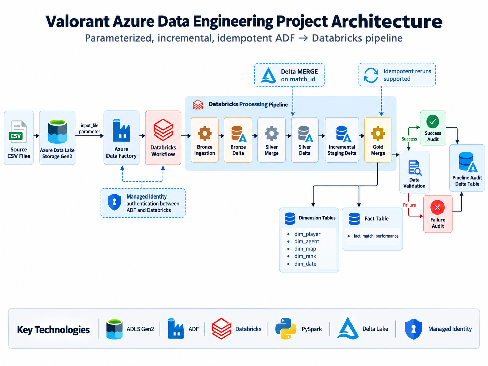

# 🎮 Valorant Azure Data Engineering Project

## 📌 Project Overview

This project demonstrates an end-to-end Azure Data Engineering pipeline built using Azure Data Lake Storage Gen2, Azure Data Factory, Azure Databricks, PySpark, and Delta Lake.

The pipeline processes Valorant gameplay data using a Medallion Architecture and supports:

- Dynamic file ingestion
- Incremental data processing
- Delta MERGE / Upsert
- Idempotent pipeline execution
- Star Schema modeling
- Data validation
- Success and failure audit logging
- Pipeline monitoring
- Delta table optimization
- Managed Identity based authentication

---

## 🏗️ Architecture

### High-Level Flow

Source CSV Files  
↓  
Azure Data Lake Storage Gen2  
↓  
Azure Data Factory  
↓  
Databricks Workflow  
↓  
Bronze Layer  
↓  
Silver Layer  
↓  
Incremental Staging  
↓  
Gold Layer  
↓  
Data Validation  
↓  
Success / Failure Audit  

---

## 🛠️ Technology Stack

- Azure Data Lake Storage Gen2
- Azure Data Factory
- Azure Databricks
- Databricks Workflows
- PySpark
- Delta Lake
- Managed Identity
- Medallion Architecture
- Star Schema

---

## 🥉 Bronze Layer

The Bronze layer is responsible for ingesting incoming Valorant CSV files from ADLS Gen2.

The source filename is dynamically passed to Databricks using the `input_file` parameter.

Example:

`valorant_incremental_day5_250.csv`

The notebook dynamically creates the ADLS source path using this parameter.

This removes hard-coded source file dependencies from the pipeline.

---

## 🥈 Silver Layer

The Silver layer performs data cleaning and standardization.

Key transformations include:

- Duplicate removal using `match_id`
- Date conversion
- Numeric data type conversion
- Data standardization
- Incremental processing

The cleaned incoming batch is used as the source for Delta MERGE.

The Silver notebook uses `match_id` as the MERGE key and performs UPDATE for existing records and INSERT for new records. :chatgpt-content-reference{index="0"}

### Incremental MERGE Logic

If `match_id` already exists:

`UPDATE`

If `match_id` does not exist:

`INSERT`

The Delta MERGE implementation makes the pipeline safe to rerun without creating duplicate match records. :chatgpt-content-reference{index="1"}

---

## 🔄 Incremental Processing

A sample incremental batch contained:

- 250 incoming records
- 50 existing records
- 200 new records

The existing records were updated while new records were inserted.

Final validated dataset:

- Silver Rows: **10,600**
- Gold Rows: **10,600**
- Unique Match IDs: **10,600**

Rerunning the same source file does not increase the final row count, demonstrating idempotent pipeline behavior.

---

## 🗂️ Incremental Staging Layer

The cleaned incremental batch is written to a Delta staging location.

This staging layer acts as a persistent handoff between the Silver and Gold workflow tasks.

The Silver notebook writes the incremental source dataset to the staging Delta location before performing the Silver MERGE. :chatgpt-content-reference{index="2"}

---

## 🥇 Gold Layer

The Gold layer implements a Star Schema designed for analytics.

### Dimension Tables

- `dim_player`
- `dim_agent`
- `dim_map`
- `dim_rank`
- `dim_date`

### Fact Table

- `fact_match_performance`

The fact table contains measures such as:

- Kills
- Deaths
- Assists
- Headshots
- Damage
- Rounds Played
- Match Result

The original Gold layer builds player, agent, map, rank, and date dimensions from the cleaned Silver dataset. :chatgpt-content-reference{index="3"}

The fact table joins the Silver dataset with the dimension tables to store the related dimension keys together with gameplay metrics. :chatgpt-content-reference{index="4"}

---

## 🔁 Gold Incremental MERGE

The current incremental staging dataset is joined with the dimension tables to create an incremental fact dataset.

The resulting records are MERGED into `fact_match_performance` using `match_id`.

Existing matches are updated and new matches are inserted.

---

## 🏭 Azure Data Factory Orchestration

Azure Data Factory acts as the outer orchestration layer.

ADF passes the filename dynamically using:

`input_file`

Example:

`valorant_incremental_day5_250.csv`

ADF then triggers the Databricks Workflow.

---

## ⚙️ Databricks Workflow

The primary workflow contains:

Bronze Ingestion  
↓  
Silver Merge  
↓  
Gold Merge  
↓  
Data Validation  
↓  
Pipeline Audit  

A separate failure audit task is configured to execute when at least one processing task fails.

---

## ✅ Data Validation

Automated validation checks include:

- Duplicate `match_id` detection in Silver
- Duplicate `match_id` detection in Gold
- Silver and Gold row-count comparison
- Foreign key completeness
- Basic numeric data-quality checks

The validation notebook raises an exception when duplicate IDs are detected or Silver and Gold row counts do not match. :chatgpt-content-reference{index="5"}

Final validated state:

Silver Rows: `10600`  
Gold Rows: `10600`  
Unique Match IDs: `10600`  
Missing Foreign Keys: `0`

---

## 📊 Pipeline Audit Framework

A Delta-based audit framework captures information for every pipeline execution.

Audit fields include:

- Pipeline Name
- Input File
- Silver Row Count
- Gold Row Count
- Status
- Run Timestamp

Example successful execution:

Pipeline: `Valorant_Data_Engineering_Pipeline`

Input File: `valorant_incremental_day5_250.csv`

Silver Rows: `10600`

Gold Rows: `10600`

Status: `SUCCESS`

---

## ❌ Failure Handling

A dedicated Failure Audit task is configured using Databricks Workflow conditional execution.

A controlled test was performed using:

`valorant_file_not_exist.csv`

Expected behavior:

Bronze Ingestion → FAILED  
Silver Merge → SKIPPED  
Gold Merge → SKIPPED  
Data Validation → SKIPPED  
Success Audit → SKIPPED  
Failure Audit → SUCCESS  

The failed execution was successfully written to the pipeline audit Delta table with:

`status = FAILED`

---

## ⚡ Delta Lake Optimization

The Silver and Gold Delta tables are optimized using:

`OPTIMIZE`

and

`ZORDER BY (match_id)`

Delta transaction history is also used to inspect pipeline operations and MERGE metrics.

---

## 🔐 Security

The integration between Azure Data Factory and Azure Databricks uses Managed Identity authentication.

This avoids storing PAT tokens or passwords directly inside pipeline notebooks.

No credentials, secrets, access keys, or passwords are included in this repository.

---

## 📁 Project Structure

valorant-azure-data-engineering-project/
│
├── notebooks/
│   ├── Common_Config.py
│   ├── Bronze_Ingestion.py
│   ├── Silver_Merge.py
│   ├── Gold_Merge.py
│   ├── Data_Validation.py
│   ├── Pipeline_Audit.py
│   ├── Failure_Audit.py
│   ├── Delta_Optimization.py
│   └── Pipeline_Health_Check.py
│
├── sample-data/
│   └── valorant_sample.csv
│
├── architecture/
│   └── architecture-diagram.png
│
└── README.md

---

## 🎯 Key Data Engineering Concepts Demonstrated

- End-to-End Data Pipeline Development
- Azure Data Factory Orchestration
- Azure Databricks Workflows
- ADLS Gen2
- Medallion Architecture
- PySpark Transformations
- Delta Lake
- Delta MERGE / Upsert
- Incremental Data Processing
- Idempotent Pipeline Design
- Dynamic Parameterization
- Star Schema Modeling
- Dimension and Fact Tables
- Data Quality Validation
- Audit Logging
- Failure Handling
- Managed Identity
- Delta Optimization
- Pipeline Monitoring

---

## 📈 Final Result

The completed pipeline successfully processes Valorant gameplay data through an automated Azure Data Engineering architecture.

The pipeline is:

✅ Incremental  
✅ Parameterized  
✅ Idempotent  
✅ Modular  
✅ Validated  
✅ Auditable  
✅ Failure-aware  
✅ Optimized  

Final dataset:

**10,600 unique Valorant match records**

---

## 👤 Author

**Shubham Warade**

Azure Data Engineering Portfolio Project
